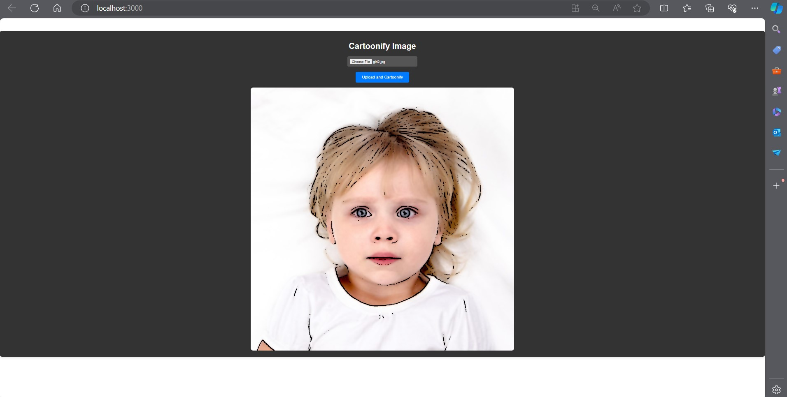

# Cartoonifying App

## Overview

The Cartoonifying App is a web-based application that allows users to upload images and convert them into cartoon-like images. 


## Features

- Upload images to be cartoonified.
- View and download cartoonified images.

## Technologies Used

- **Backend**: Python, Flask
- **Frontend**: React.js

## Installation

### Prerequisites

- Python 3.x
- Node.js and npm

### Backend Setup

1. Clone the repository:

    ```bash
    git clone https://github.com/AyishaIlyas/Cartoonify-app.git
    ```

2. Navigate to the backend directory:

    ```bash
    cd backend
    ```

3. Create and activate a virtual environment:

    ```bash
    python -m venv venv
    source venv/bin/activate  # On Windows use `venv\Scripts\activate`
    ```

4. Install the dependencies:

    ```bash
    pip install -r requirements.txt
    ```

5. Run the Flask application:

    ```bash
    python app.py
    ```

### Frontend Setup

1. Navigate to the frontend directory:

    ```bash
    cd cartoonify-frontend
    ```

2. Install the dependencies:

    ```bash
    npm install
    ```

3. Start the React application:

    ```bash
    npm start
    ```

## Configuration

### Backend

Update the `config.py` file with your configurations, if any.

### Frontend

Update the API endpoint in your React application to match the backend URL

## Usage

1. Open the application in your browser.
2. Upload an image you want to cartoonify.
3. Wait for the cartoonified image to be generated.

